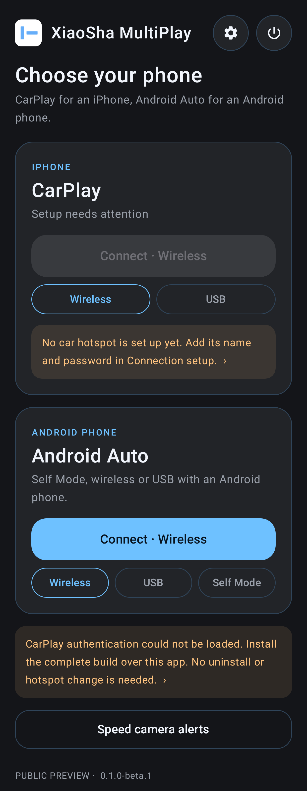

<p align="center">
  
</p>

<h1 align="center">XiaoSha MultiPlay</h1>

<p align="center">
  Turn an Android phone into a car screen: <b>CarPlay</b> for an iPhone, <b>Android Auto</b> for an Android phone.<br>
  <a href="README.md">繁體中文</a> ·
  <a href="https://github.com/XiaoSha-0711/DiPlay/actions/workflows/build-apk.yml">Download APK</a> ·
  <a href="https://github.com/XiaoSha-0711/DiPlay/issues">Report a problem</a>
</p>

<p align="center">
  
</p>

<p align="center">
  
</p>

## Features

| | CarPlay (iPhone) | Android Auto (Android phone) |
|---|---|---|
| Wireless | ✅ Car hotspot / Wi-Fi Direct | ✅ |
| USB | ✅ | ✅ |
| Self Mode | — | ✅ Android Auto on the same phone |

- **One screen for both**: two cards on the home screen; one tap connects, and the app remembers how you last connected.
- **Connect when the app opens**, using your last connection.
- **Exit when disconnected**: closes 30 s after CarPlay ends or the iPhone's Bluetooth drops, so nothing drains the battery.
- **Day/night mode**: automatic, day or night.
- **Video while parked**: the iOS 27 CarPlay video feature, off by default and for use only when parked.
- **Speed camera shortcut**: opens the speed-camera app you choose with one tap.
- **Lean**: only what CarPlay and Android Auto need; the power button fully exits the app.
- **7 languages**: English, 繁體中文, 简体中文, Español, Русский, Українська, العربية.

## Install

1. Open [Actions → Build APK](https://github.com/XiaoSha-0711/DiPlay/actions/workflows/build-apk.yml) and pick the latest green run.
2. Under **Artifacts**, download `xiaosha-multiplay-…` and unzip it to get the APK.
3. Install it on the **Android phone** that stays in the car (not the iPhone). Android 9 or later.
4. Open the app, set up the car hotspot or connection type in Settings, then tap Connect on the home screen.

Install new builds over the old one; your settings are kept.

## Build from source

Requires JDK 25 and Android SDK 37.

```sh
./gradlew :mobile:assembleDebug
```

The CarPlay authentication files are not in the repository. They live in GitHub Secrets (`DIPLAY_IDENTITY_PK8_B64`, `DIPLAY_CERTIFICATE_P7B_B64`) and [build-apk.yml](.github/workflows/build-apk.yml) adds them at build time. Without them the app still builds, but cannot connect to an iPhone; Android Auto is unaffected. See [docs/BUILD.md](docs/BUILD.md).

## Notes

- This is not an Apple- or Google-certified product; future iOS or Android Auto updates may break it.
- Keep your attention on the road; use video only while parked.
- CarPlay is a trademark of Apple Inc. and Android Auto of Google LLC. This project is not affiliated with either.

## Sources and licenses

- CarPlay protocol: [xcertplay](https://github.com/shilapi/xcertplay) (GPL-3.0) and [DiPlay](https://github.com/shihabal3amri/DiPlay)
- Android Auto: [Open Headunit](https://github.com/andreknieriem/open-headunit) (AGPL-3.0)
- Interface design adapted from [DiAuto](https://github.com/shihabal3amri/DiAuto) (AGPL-3.0)

See [LICENSE](LICENSE) and [docs/THIRD_PARTY_NOTICES.md](docs/THIRD_PARTY_NOTICES.md).
