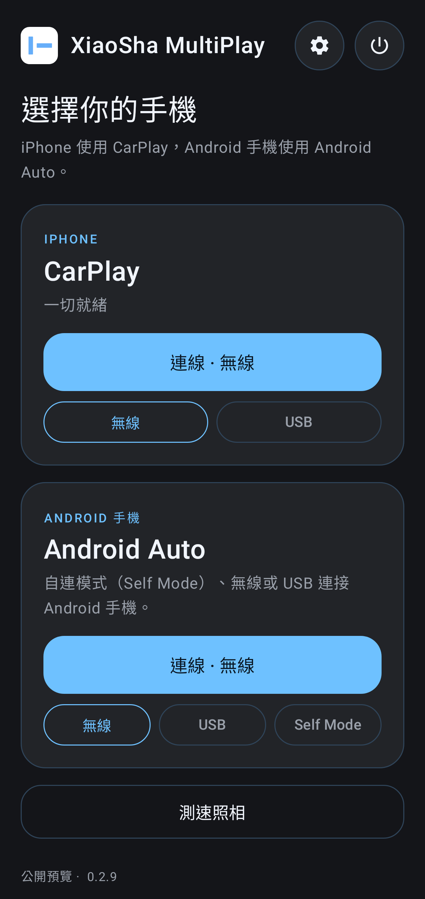
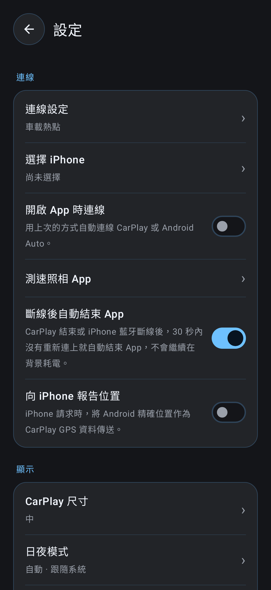

<p align="center">
  
</p>

<h1 align="center">XiaoSha MultiPlay</h1>

<p align="center">
  把一支 Android 手機變成車用螢幕：iPhone 跑 <b>CarPlay</b>，Android 手機跑 <b>Android Auto</b>。<br>
  <a href="README.en.md">English</a> ·
  <a href="https://github.com/XiaoSha-0711/DiPlay/actions/workflows/build-apk.yml">下載 APK</a> ·
  <a href="https://github.com/XiaoSha-0711/DiPlay/issues">回報問題</a>
</p>

<p align="center">
  
  &nbsp;
  
</p>

<p align="center">
  
</p>

## 功能

| | CarPlay（iPhone） | Android Auto（Android 手機） |
|---|---|---|
| 無線 | ✅ 車機熱點 / Wi-Fi Direct | ✅ |
| USB | ✅ | ✅ |
| Self Mode | — | ✅ 在同一支手機上跑 Android Auto |

- **一個介面管兩種投影**：首頁兩張卡片，按一下就連線，App 會記住上次用的方式。
- **開啟 App 時自動連線**：用上次的方式自動連 CarPlay 或 Android Auto。
- **斷線後自動結束 App**：CarPlay 結束或 iPhone 藍牙斷線 30 秒後自動關閉，不在背景耗電。
- **日夜模式**：自動、白天或夜間。
- **停車時播放影片**：iOS 27 的 CarPlay 影片功能（手動開啟，僅限停車使用）。
- **測速照相快捷鍵**：首頁一鍵開啟你選的測速照相 App。
- **省電**：只保留 CarPlay 和 Android Auto 需要的東西，右上角的電源鍵可以完全結束 App。
- **7 種語言**：繁體中文、简体中文、English、Español、Русский、Українська、العربية。

## 安裝

1. 打開 [Actions → Build APK](https://github.com/XiaoSha-0711/DiPlay/actions/workflows/build-apk.yml)，點最新一次綠勾的執行。
2. 在頁面下方 **Artifacts** 下載 `xiaosha-multiplay-…`，解壓縮得到 APK。
3. 安裝到要放在車上的那支 **Android 手機**（不是 iPhone）。Android 9 以上。
4. 打開 App，在設定裡填好車機熱點或選擇連線方式，回首頁按「連線」。

新版直接覆蓋安裝即可，設定會保留。

## 自己編譯

需要 JDK 25 和 Android SDK 37。

```sh
./gradlew :mobile:assembleDebug
```

要能連上 iPhone，CarPlay 驗證檔不放在 repo 裡，而是放在 GitHub Secrets（`DIPLAY_IDENTITY_PK8_B64`、`DIPLAY_CERTIFICATE_P7B_B64`），由 [build-apk.yml](.github/workflows/build-apk.yml) 編譯時帶入。沒有這兩個檔案也能編譯，只是 CarPlay 連不上，Android Auto 不受影響。詳見 [docs/BUILD.md](docs/BUILD.md)。

## 注意

- 這不是 Apple 或 Google 認證的產品，未來的 iOS 或 Android Auto 更新可能讓它失效。
- 開車時請專心，影片功能只在停車時使用。
- CarPlay 是 Apple Inc. 的商標，Android Auto 是 Google LLC 的商標，本專案與兩者沒有任何關係。

## 來源與授權

- CarPlay 協定：[xcertplay](https://github.com/shilapi/xcertplay)（GPL-3.0）與 [DiPlay](https://github.com/shihabal3amri/DiPlay)
- Android Auto：[Open Headunit](https://github.com/andreknieriem/open-headunit)（AGPL-3.0）
- 介面設計參考 [DiAuto](https://github.com/shihabal3amri/DiAuto)（AGPL-3.0）

授權條款見 [LICENSE](LICENSE) 和 [docs/THIRD_PARTY_NOTICES.md](docs/THIRD_PARTY_NOTICES.md)。
